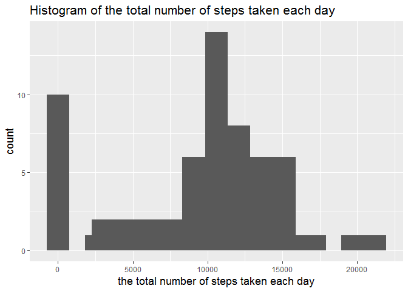
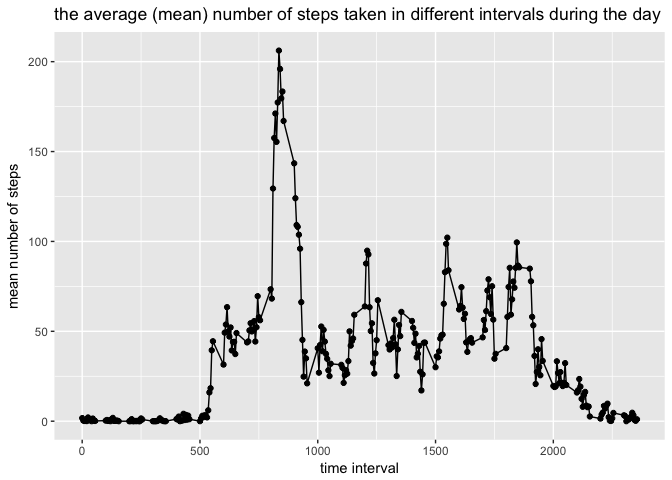
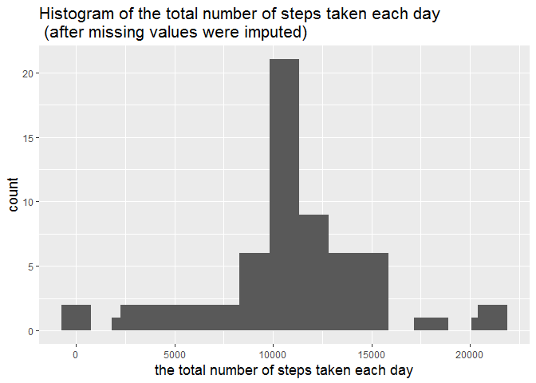

# Reproducible Research: Peer Assessment 1
Vitalii Kleshchevnikov  


## Loading and preprocessing the data

Reading data - and quick look

```r
# setwd("./RepData_PeerAssessment1")
activity.dat = read.csv("activity.csv", colClasses = c("numeric", "Date","integer"),stringsAsFactors = F)
head(activity.dat)
```

```
##   steps       date interval
## 1    NA 2012-10-01        0
## 2    NA 2012-10-01        5
## 3    NA 2012-10-01       10
## 4    NA 2012-10-01       15
## 5    NA 2012-10-01       20
## 6    NA 2012-10-01       25
```

```r
str(activity.dat)
```

```
## 'data.frame':	17568 obs. of  3 variables:
##  $ steps   : num  NA NA NA NA NA NA NA NA NA NA ...
##  $ date    : Date, format: "2012-10-01" "2012-10-01" ...
##  $ interval: int  0 5 10 15 20 25 30 35 40 45 ...
```
"spreading" data frame - so that each row contains all observations for each day,
intervals in columns

```r
activity.dat.1row.per.date = tidyr::spread(activity.dat, interval, steps)
activity.dat.1row.per.interval = tidyr::spread(activity.dat, date, steps)
# cheking how data was spread - code below produces lond output - disabled
# str(activity.dat.1row.per.date)
# str(activity.dat.1row.per.interval)
```


## What is mean total number of steps taken per day?

Calculating total number of steps per day (NA omitted) - plotting histogram

```r
total_steps.per.day = rowSums(activity.dat.1row.per.date[1:61,2:289], na.rm = T)

library(ggplot2)
qplot(x=total_steps.per.day) + geom_histogram(bins = 15)+
      xlab("the total number of steps taken each day") +
      ggtitle("Histogram of the total number of steps taken each day") +
      theme(title = element_text(size = rel(1.2)))
```

```
## `stat_bin()` using `bins = 30`. Pick better value with `binwidth`.
```

<!-- -->


```r
mean_steps.per.day = mean(total_steps.per.day)
```
mean number of steps per day is 9354


```r
median_steps.per.day = format(median(total_steps.per.day),scientific=F)
```
median number of steps per day is 10395


## What is the average daily activity pattern?
Calculating the mean number of steps per time interval (over all days) and
the interval contaning maximum number of steps

```r
mean_steps.per.interval = rowMeans(activity.dat.1row.per.interval[,2:61], na.rm = T)
max_step_interval = 
      activity.dat.1row.per.interval$interval[mean_steps.per.interval == max(mean_steps.per.interval)]
```


```r
qplot(x = activity.dat.1row.per.interval$interval, y = mean_steps.per.interval) + 
      geom_path() +
      xlab("time interval") +
      ylab("mean number of steps")+
      ggtitle("the average (mean) number of steps taken in different intervals during the day") +
      theme(title = element_text(size = rel(1)))
```

<!-- -->

The interval contaning maximum number of steps (on average(mean) across all days) - 835


## Imputing missing values


```r
missing_rows = sum(!complete.cases(activity.dat))
```
the number of rows missing observations is 2304

Imputing missing values by setting each missing observation (steps) to be equal 
to the mean number of steps taken in that interval

```r
activity.dat.1row.per.interval.imputed = activity.dat.1row.per.interval
activity.dat.1row.per.interval.imputed[is.na(activity.dat.1row.per.interval)] == activity.dat.1row.per.interval$mean_steps
```

```
## logical(0)
```

```r
activity.dat.imputed = tidyr::gather(activity.dat.1row.per.interval.imputed[,1:62],date, steps)
str(activity.dat.imputed)
```

```
## 'data.frame':	17856 obs. of  2 variables:
##  $ date : chr  "interval" "interval" "interval" "interval" ...
##  $ steps: num  0 5 10 15 20 25 30 35 40 45 ...
```
Calculating total number of steps per day (NA imputed) - plotting histogram

```r
total_steps.per.day.imputed = 
      colSums(activity.dat.1row.per.interval.imputed[,2:62], na.rm = F)

library(ggplot2)
qplot(x=total_steps.per.day.imputed) + geom_histogram(bins = 15)+
      xlab("the total number of steps taken each day") +
      ggtitle("Histogram of the total number of steps taken each day \n (after missing values were imputed)") +
      theme(title = element_text(size = rel(1.2)))
```

```
## `stat_bin()` using `bins = 30`. Pick better value with `binwidth`.
```

```
## Warning: Removed 8 rows containing non-finite values (stat_bin).

## Warning: Removed 8 rows containing non-finite values (stat_bin).
```

<!-- -->


```r
mean_steps.per.day.imputed = mean(total_steps.per.day.imputed)
```
mean number of steps per day is NA


```r
median_steps.per.day.imputed = format(median(total_steps.per.day.imputed),scientific=F)
```
median number of steps per day is 10395

## Are there differences in activity patterns between weekdays and weekends?
